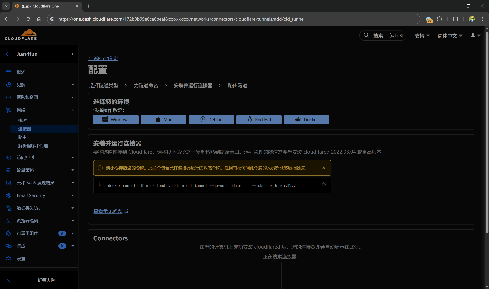
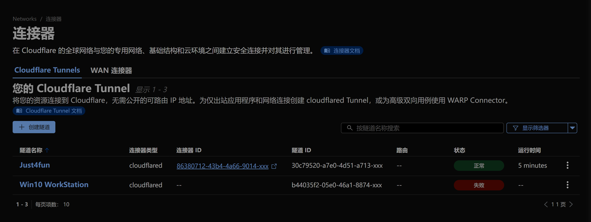
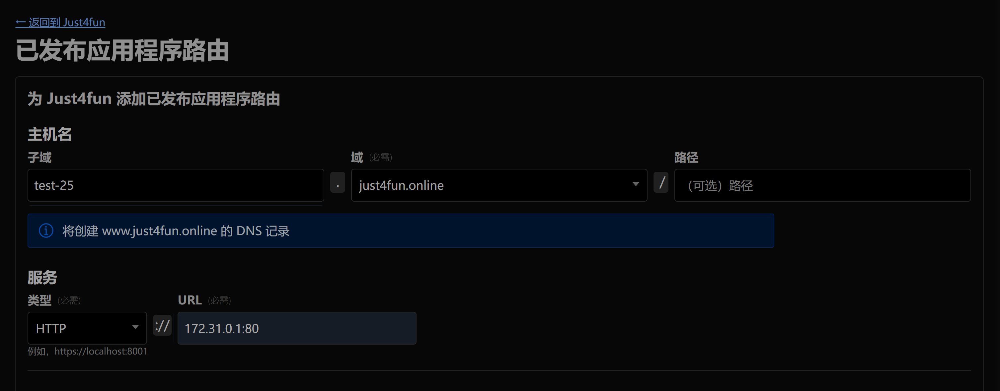
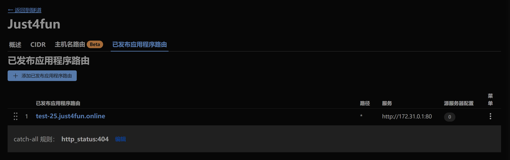

通过 Cloudflared Tunnel 开放公网访问
================================

`Cloudflared Tunnel` 是 Cloudflare 推出的一个安全隧道工具，可以轻松将本地服务（比如 web 服务、SSH）通过 Cloudflare 网络安全地暴露到公网，无需公网 IP 或者复杂的端口映射，具备防火墙和 DDoS 防护等优势。

## 安装和运行 cloudflared

首先，登录到 Cloudflare One（Zero Trust） 控制台，进入「网络」-「连接器」页面，点击“创建隧道”，新建一个 Cloudflare Tunnel（隧道类型选择 **Cloudflared**）。根据页面提示进行操作。



在「连接器」页面，可以看到你刚创建的隧道，并且它的状态为`正常`。



在隧道状态为`正常`的前提下，你就可以通过`应用程序路由`把你的 `Web 服务`、`SSH` 等服务暴露到公网。


## 远程访问本地 Web 服务

在成功创建 Cloudflare Tunnel 并确保隧道已连接后，可以轻松将本地的 Web 服务安全地通过 Cloudflare 访问公网，无需公网 IP 或路由器端口转发。通过 Cloudflare 的零信任网络，还能获得 DDoS 防护、WAF 等安全能力，非常适用于家庭 NAS、个人博客、仪表盘等 Web 应用的远程访问需求。

下面将详细介绍如何将本地的 Web 服务接入 Cloudflare Tunnel，实现安全的公网远程访问。

配置隧道，在「已发布应用程序路由」页面。参考下图添加你的`已发布应用程序路由`。



> ⚠️ 注意：使用三级及以上子域可能不能正常使用。Cloudflare 免费的 HTTPS 证书只支持二级子域。

> ⚠️ 注意: 如果你和我一样通过 docker 运行 cloudflared，那么 URL 应该使用 docker 网络中宿主机 IP。




## 快速隧道

Cloudflared 提供了“快速隧道”功能（Quick Tunnel），让你无需在 Cloudflare 控制台提前注册隧道、配置 DNS、授权机器，仅通过一条命令即可快速将本地服务暴露到公网。这非常适合临时测试、演示或内网穿透场景。

优点包括：
- **无需复杂配置**，无需登录 Cloudflare，无需提前创建 tunnel。
- Cloudflare 会分配一个临时的域名（通常为 `trycloudflare.com` 域名），即刻可访问。
- 支持任意本地端口的 Web 服务。

### 快速隧道的使用方法

假设本地有一个 Web 服务在 8080 端口，可以用以下命令临时暴露：

```bash
cloudflared tunnel --url http://localhost:8080
```

如果你只想快速测试，也可以使用如下简写命令，Cloudflared 会自动帮你分配一个端口和域名：

```bash
cloudflared tunnel
```

执行后，你会看到类似如下的输出：

```
Your quick Tunnel has been created!
https://adjective-noun-12345678.trycloudflare.com
```

现在你就可以通过上面分配的域名，直接从公网访问你的本地服务了。

> ⚠️ 注意：快速隧道分配的域名只会在本次会话临时有效，通常适用于开发演示或临时访问，不建议长期暴露生产服务。


## 安全远程 SSH

利用 Cloudflared 也可以将局域网内主机的 SSH 服务安全暴露到公网，无需暴露真实端口，有效降低被扫描和攻击的风险。

这种方式不仅提高了 SSH 安全性，还可以配合 Cloudflare Access 实现基于身份的访问控制。

待完善 ...
